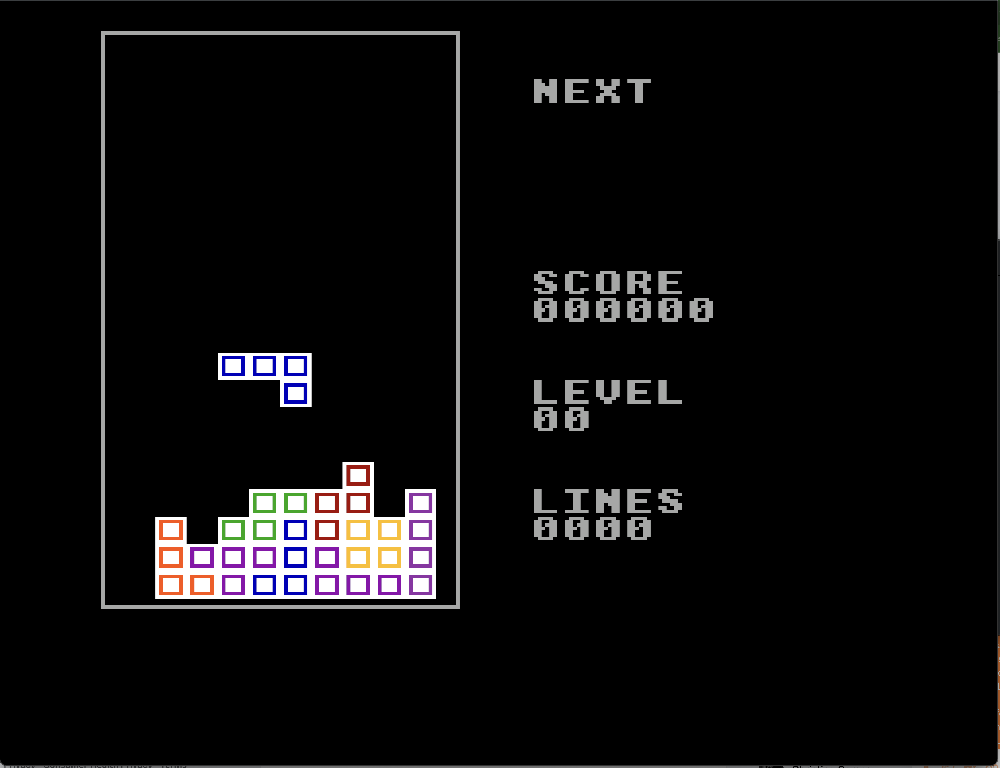

# SNESser



A batteries-included framework and build chain for SNES games in 65816 assembly. Creates ROMs that run on emulators (OpenEmu, bsnes, Mesen-S) or real hardware via flash carts.

## What's Included

- **Reusable library** (`lib/`) -- hardware init, input with DAS, DMA helpers, PPU setup, math, SPC700 driver
- **Linker config** (`cfg/`) -- 256KB LoROM memory map ready to go
- **Tools** (`tools/`) -- setup script, PNG-to-SNES tile converter
- **Tetris** (`games/tetris/`) -- fully playable Tetris with SRS rotations, scoring, levels, and line clearing
- **Hello template** (`templates/hello/`) -- minimal ROM that displays a solid color screen, good starting point for new games

## Quick Start

```bash
# Install cc65 toolchain
make setup

# Build everything
make

# Build just Tetris
make -C games/tetris

# Open in emulator (macOS)
open games/tetris/tetris.sfc
```

## Project Structure

```
snesser/
├── lib/                    # Reusable assembly libraries
│   ├── registers.inc       # All SNES hardware register definitions
│   ├── header.inc          # ROM header + vector table macros
│   ├── init.asm            # Boot initialization (CPU, PPU, RAM clear)
│   ├── input.asm           # Joypad reading with edge detection
│   ├── dma.asm             # DMA helpers (VRAM, CGRAM, OAM)
│   ├── ppu.asm             # PPU mode/layer/brightness setup
│   ├── math.asm            # Hardware multiply/divide wrappers
│   └── spc700.asm          # SPC700 sound driver upload + control
├── cfg/
│   └── lorom256k.cfg       # Linker config for 256KB LoROM
├── tools/
│   ├── setup.sh            # Install cc65 + Python deps
│   └── png2snes.py         # PNG -> SNES 4bpp tiles + palette
├── games/
│   └── tetris/             # Full Tetris implementation
│       ├── main.asm        # Entry point, NMI handler, main loop, input
│       ├── game.asm        # Board state, movement, collision, line clearing
│       ├── pieces.asm      # Tetromino bitmasks (SRS rotations) + colors
│       ├── render.asm      # Tilemap rendering (board, piece, score UI)
│       ├── scores.asm      # Score/level/lines tracking + BCD conversion
│       └── data/           # Tile graphics, palettes, font, playfield border
├── templates/
│   └── hello/              # Minimal ROM starting point
└── Makefile                # Top-level build (builds all games)
```

## Making a New Game

1. Copy the template:
   ```bash
   cp -r templates/hello/ games/mygame/
   ```

2. Edit `games/mygame/main.asm` -- update the ROM_HEADER title, add your init and game loop

3. Edit `games/mygame/Makefile` -- add source files and whichever lib modules you need

4. Build:
   ```bash
   make -C games/mygame
   ```

## Tetris Controls

| Button | Action |
|--------|--------|
| D-pad Left/Right | Move piece (with DAS auto-repeat) |
| D-pad Down | Soft drop |
| A / Up | Rotate clockwise |
| B | Hard drop |
| Start | Restart (on game over screen) |

## Requirements

- **cc65** (provides `ca65` assembler and `ld65` linker)
- **Python 3 + Pillow** (optional, for `png2snes.py` graphics converter)
- **SNES emulator** for testing (OpenEmu, bsnes-plus, Mesen-S)

## Known Limitations

- SPC700 sound driver upload is disabled pending protocol debugging -- sound effects are no-ops
- Score display uses 16-bit division (accurate up to 65535; full 24-bit BCD conversion is a TODO)
- No title screen -- game starts immediately
